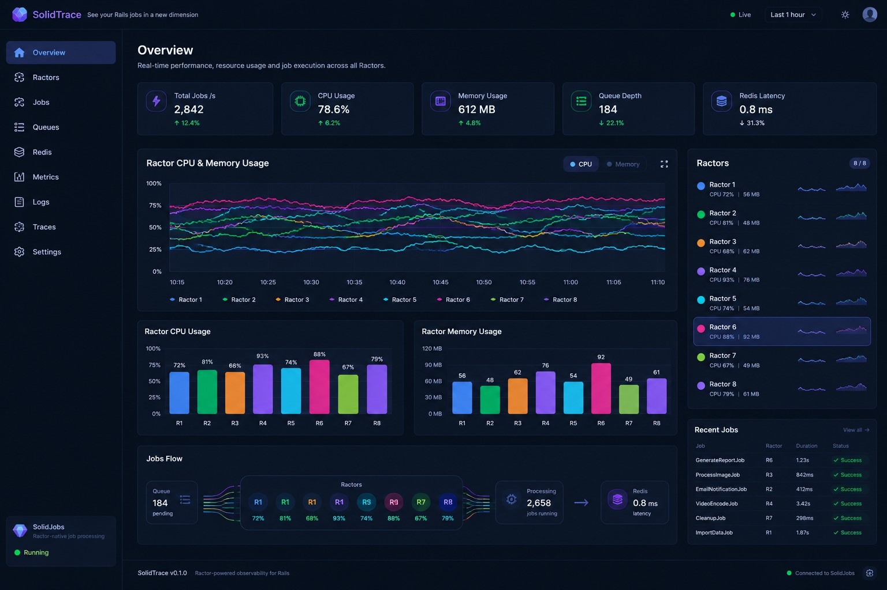

# SolidTrace

SolidTrace is an observability dashboard for applications that use SolidJobs
for background job processing with multiple Ruby Ractors. It gives operators
a live view of job execution and the health of the processes, queues, and Redis
that support it.

This repository contains SolidTrace showcase images, not the dashboard source
code. The dashboard implementation is maintained separately in
`solid-trace-web`.

## What SolidTrace does

The web dashboard reads structured telemetry collected and aggregated by the
SolidTrace engine. It is designed to help answer questions such as:

- Are workers and Ractors reporting healthy, fresh telemetry?
- Which jobs are running, completed, failing, or retrying?
- Are queues accumulating work, and how quickly are jobs being processed?
- Are the application processes or Redis showing resource or latency issues?
- What lifecycle events and durations were observed for a job execution?

The dashboard is read-only: it observes the job system rather than running
jobs or replacing its worker processes. Live updates are delivered over a
Server-Sent Events (SSE) stream. The stream sends an initial snapshot, followed
by updates; it can resume from a client cursor and resynchronize when continuity
cannot be guaranteed. Connection freshness, stale or unavailable data,
disconnection, and data-loss/resynchronization states are surfaced rather than
presented as healthy measurements.

## Dashboard areas

- **Overview** — summarizes job throughput, process CPU time and resident
  memory, queue depth, and Redis latency. It includes bounded resource history,
  process/queue/Ractor flow, recent jobs, and telemetry health. CPU and memory
  measurements are process-scoped; per-Ractor CPU and memory are not inferred
  when they are unavailable.
- **Ractors** — presents the reporting processes and Ractors, their observed
  operational state, resource information where available, and job activity.
- **Jobs** — lets operators inspect recent job executions, statuses, observed
  durations, attempts, and related lifecycle information.
- **Queues** — shows queue activity and the available queue-related telemetry,
  such as pending work and processing behavior.
- **Redis** — displays Redis connection and operational telemetry, including
  latency and resource information when reported.
- **Traces** — explores retained job lifecycle events, observed transitions,
  attempts, and calculable durations. It distinguishes observed facts from
  missing or unknown information.

The showcase artwork also depicts concepts such as dedicated Metrics, Logs,
and Settings pages and richer controls. Those screens are part of the visual
concept; this image-only repository does not implement them.

## Data handling and deployment

The dashboard consumes SolidTrace's aggregated read model, backed by Redis.
Trace views use structured lifecycle telemetry retained for a limited window
(15 minutes in the current dashboard contract). They do not render job
payloads, arguments, raw errors, or free-form text log lines. Missing events
and durations that cannot be calculated remain unavailable rather than being
guessed.

The web dashboard is a separately versioned Sinatra/Rack component that can
be mounted in a Rails application. Rails is not a runtime dependency of the
dashboard gem. The host application is responsible for authentication,
authorization, TLS, and protecting the entire mounted URL prefix. The host
also manages graceful shutdown of the dashboard and its live SSE sessions.

## Showcase images

### Overview concept

### Multi-page dashboard concept

For access to the SolidTrace dashboard implementation, please contact me.